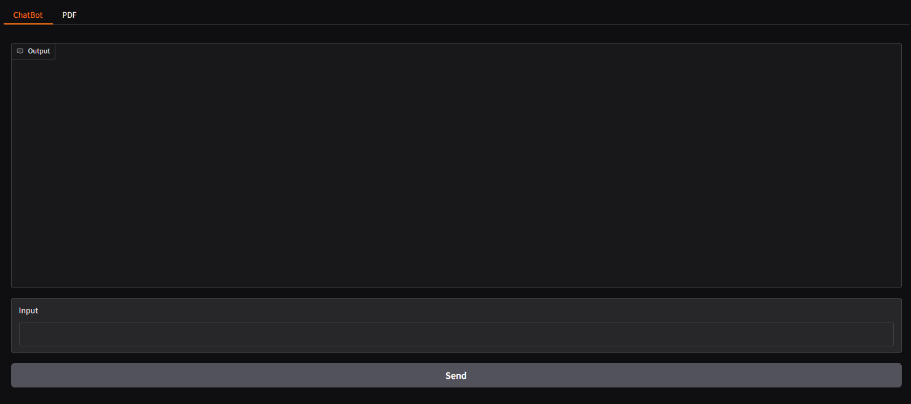

# 💬 Streaming Chatbot with OpenAI, Flask & Gradio

Ứng dụng Chat Bot với khả năng **phản hồi dạng streaming** sử dụng OpenAI SDK. Được xây dựng giao diện đơn giản bằng Gradio.

---

## 🚀 Tính năng

- 🤖 Chat GPT hỗ trợ streaming phản hồi
- 🔐 Sử dụng API Key từ OpenAI
- 🌐 Giao diện đơn giản bằng Gradio

---

## 🛠️ Công nghệ sử dụng

- Python 3.x
- Flask
- OpenAI SDK
- Gradio

---

## 📦 Cài đặt

### 1. Clone project

```bash
git clone https://github.com/baole7308/chatbotLMM.git
cd chatbotLMM
```

### 2. Cài đặt thư viện

```bash
pip install -r requirements.txt
```

> `requirements.txt` bao gồm:
>
> ```
> openai
> gradio
> requests
> ```

### 3. Cấu hình API Key

API được lấy từ trang https://openrouter.ai
Chọn model : gpt-3.5-turbo-0613

Tạo file `.env` (hoặc chỉnh trực tiếp trong code):

```bash
OPENAI_API_KEY=your_openai_api_key_here
BASE_URL=https://openrouter.ai/api/v1
```

Trong file Python, cấu hình như sau:

```python
import os
openai.api_key = os.getenv("OPENAI_API_KEY")
```

---

## ▶️ Chạy ứng dụng

### Bước 1: Chạy chatbot

```bash
python chatbot.py
```

### Bước 2: Chạy frontend Gradio

```bash
python interface.py
```

---

### Bước 3: Chạy hàm main

```bash
python main.py
```

---

## 📺 Demo Giao Diện



---

## 📂 Cấu trúc thư mục

```
streaming-chatbot/
├── .env
├── chatbot.py
├── image.png
├── interface.py
├── main.py
├── README.md
└── requirements.txt
```

---
